# Dubai AI Broker Assistant

**An AI assistant that does a Dubai real-estate agent's admin work.** Part CRM, part
Claude-powered assistant, built as multi-tenant SaaS so many agencies can use one
deployment while each sees only its own data.

> **Live demo:** https://dubai-real-estate-ashy.vercel.app · `demo@demo.ae` / `demo12345`
> **API:** https://dubai-broker-api.onrender.com/health
>
> The API runs on a free Render instance that sleeps after 15 minutes idle — the
> first request after a quiet spell can take ~30 seconds.

| | |
|---|---|
| **Frontend** | Next.js 14 · TypeScript · Tailwind · Recharts · Leaflet · Framer Motion |
| **Backend** | FastAPI (async) · SQLAlchemy 2.0 · Pydantic v2 |
| **Database** | PostgreSQL (Supabase) |
| **AI** | Anthropic Claude with tool-calling |
| **Hosting** | Vercel (web) · Render (API) · Supabase (database) |

---

## The problem

A Dubai agent juggles six to eight disconnected tools — portals for listings,
spreadsheets for leads, WhatsApp for clients, Canva for marketing, a separate CRM —
and does the same work by hand every day: matching buyers to stock, writing pitches,
chasing follow-ups, tracking commission.

This puts all of it in one place, and hands the repetitive parts to Claude.

---

## Screenshots

### Dashboard

Live stats, a Dubai market map where circle size is inventory and colour is the
average price band, plus lead and inventory breakdowns.

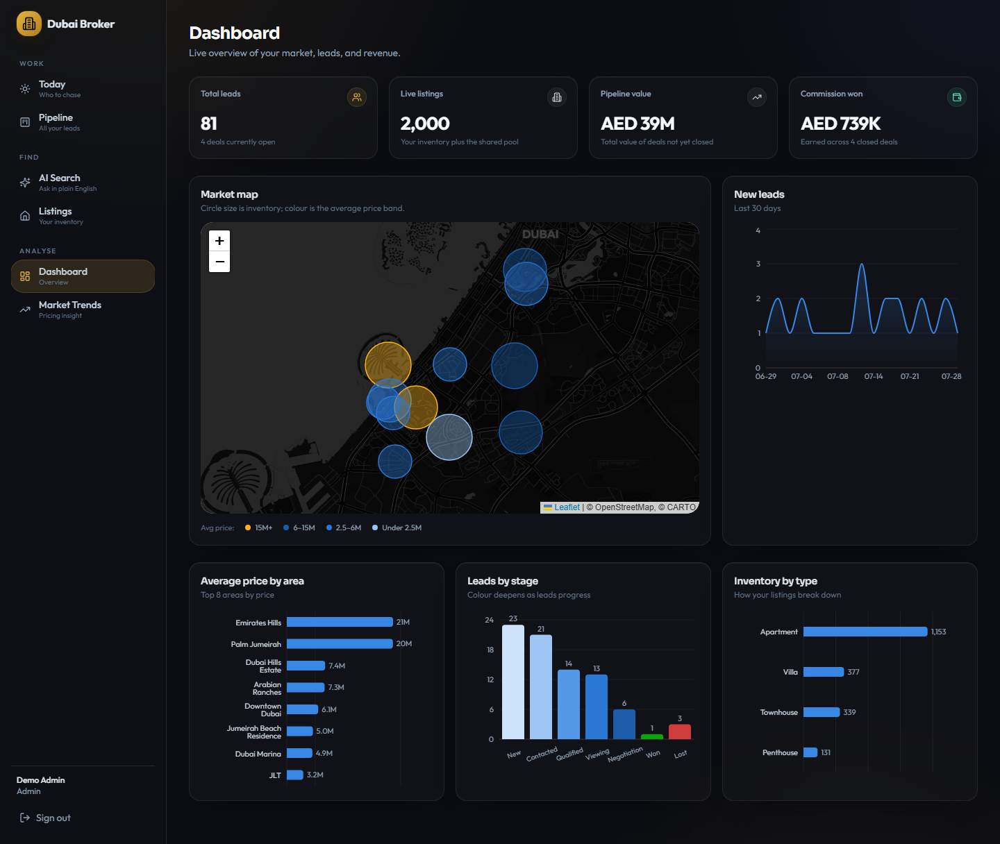

### Today — the follow-up engine

The page an agent opens each morning: exactly who to contact, ordered most-overdue
first. **This runs on rules, not AI — it costs zero tokens.** Claude is only called
when you press *Draft*.

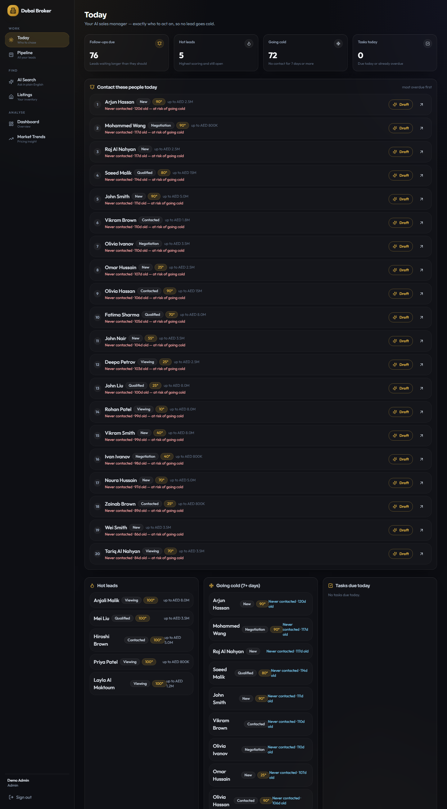

### Pipeline

Every lead from first contact to closed deal. All seven stages fit on screen and
wrap responsively rather than scrolling sideways.

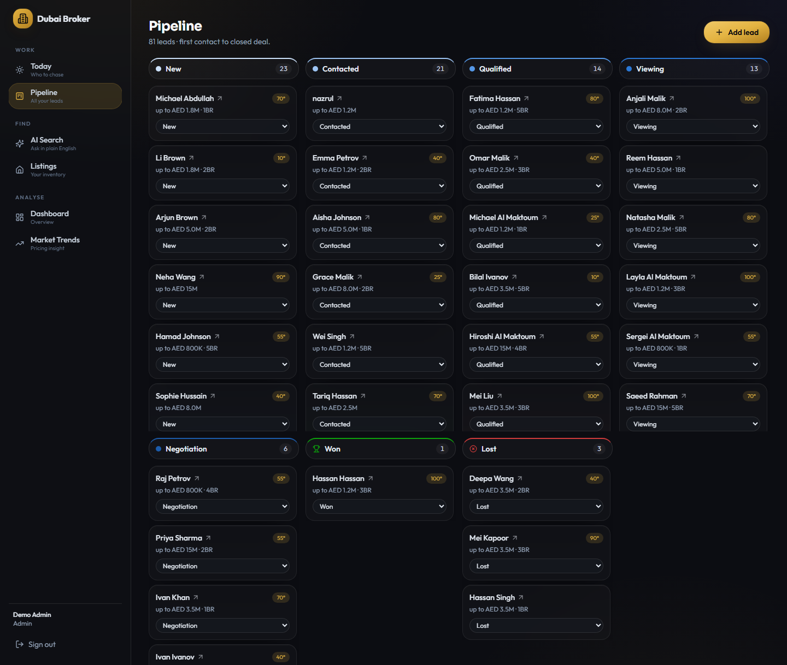

### AI Search

Plain-English search that calls a real database tool — not a chatbot guessing at
listings.

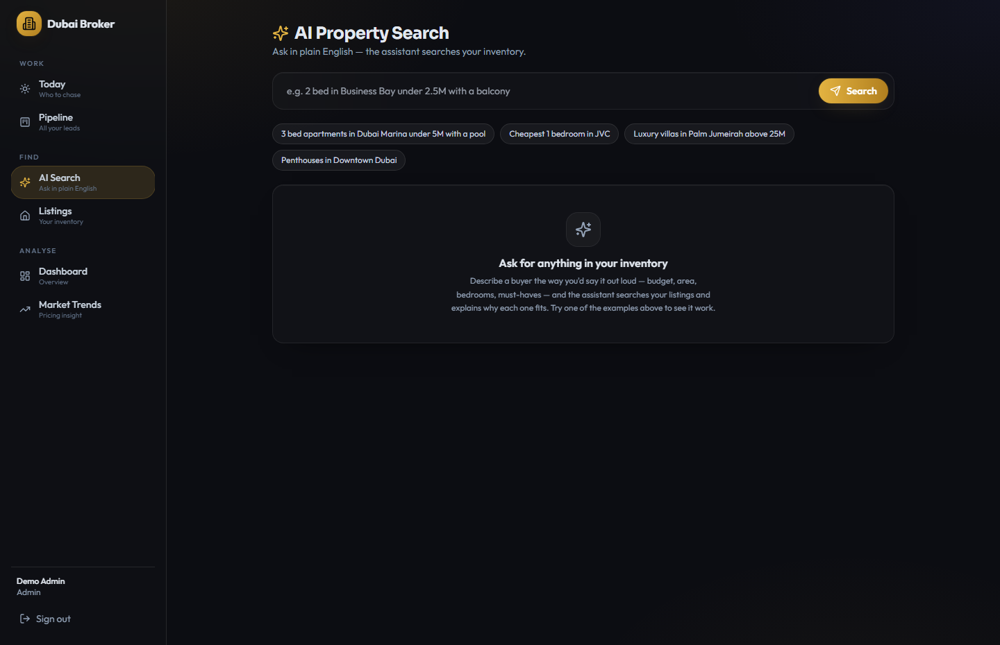

### Listings

Inventory with photos. Import live Dubai listings from Bayut by area, or upload
your agency's own stock as CSV.

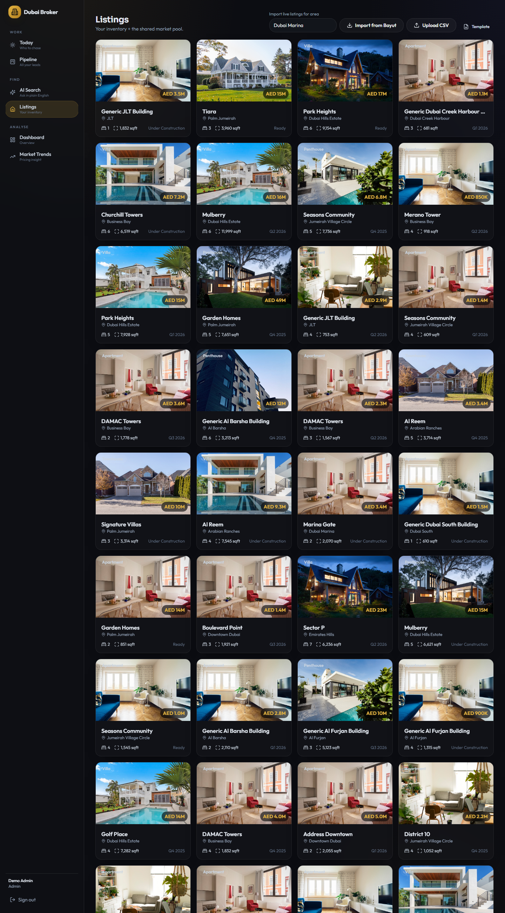

### Market Trends

Nine views of your inventory: price distribution, bedroom mix, price-per-sqft by
area, size-vs-price scatter, area comparison, and more.

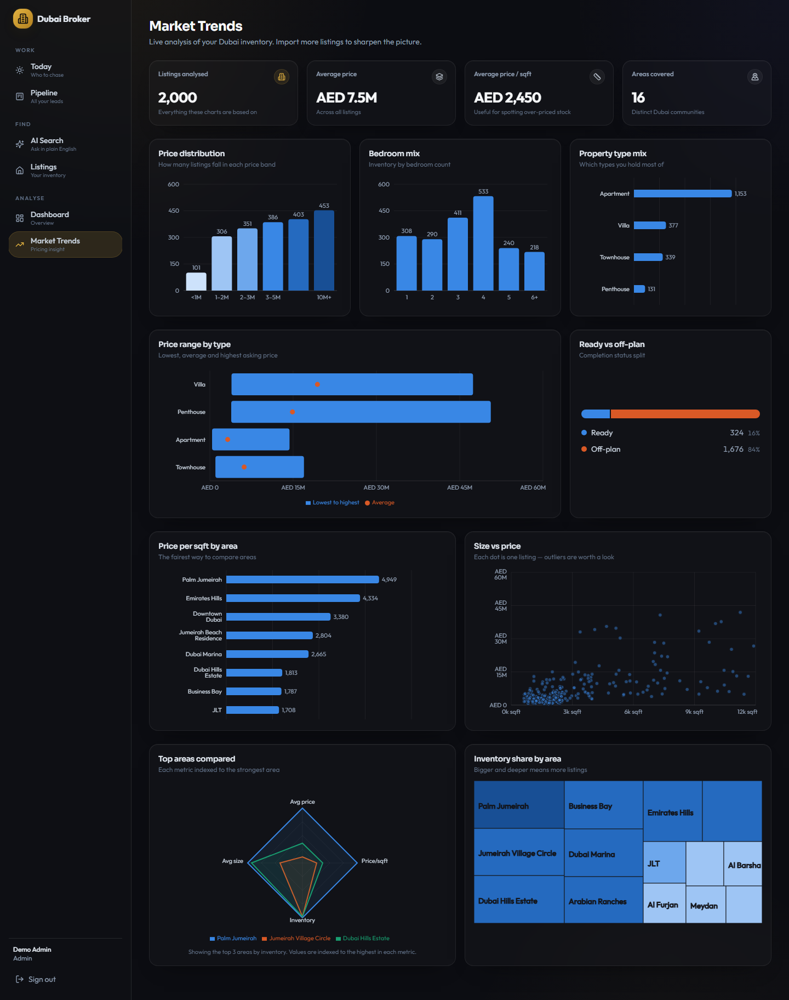

### On a phone

The whole app works at 390px. Below `lg` the sidebar collapses behind a hamburger
drawer.

| Dashboard | Today | Pipeline |
|---|---|---|
| 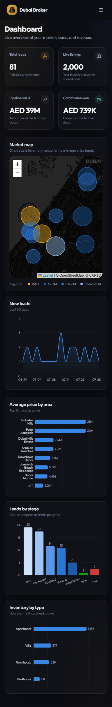 | 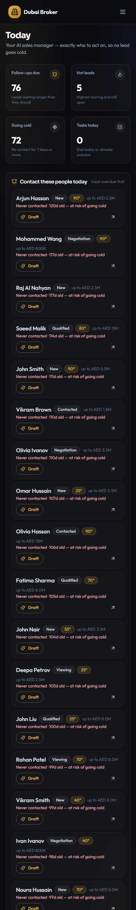 | 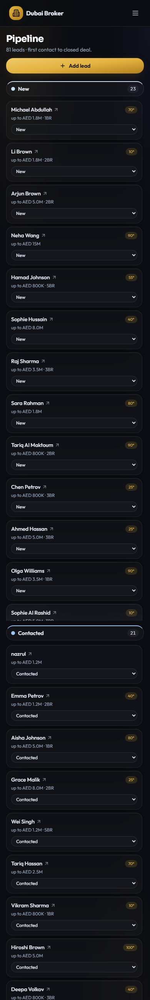 |

---

## What it does

### CRM
- Agency signup, agent invites, roles (`admin` / `agent`), JWT auth
- Leads with full buyer requirements (budget, beds, type, preferred areas, language)
- Kanban pipeline: New → Contacted → Qualified → Viewing → Negotiation → Won / Lost
- Activity timeline per lead (call, WhatsApp, email, meeting, viewing, note)
- Tasks and reminders; deals with commission and payment tracking

### The AI brain
| Feature | What it does |
|---|---|
| **Search** | "3 bed in Dubai Marina under 5M with a pool" → Claude calls a tenant-scoped DB tool and explains the results |
| **Match** | Ranks the best listings for a specific lead, with a reason per pick |
| **Pitch** | Writes a ready-to-send WhatsApp or email message **in the client's language** |
| **Marketing** | Portal listing, Instagram caption, ad variants, story script, email blast — returned as structured JSON |
| **Follow-up draft** | Short, on-demand nudge for a lead who's gone quiet |

### Inventory
- Bayut import via RapidAPI, filtered to the community you ask for, auto-deduped
- CSV upload for an agency's own listings, with a downloadable template
- ~2,000 synthetic Dubai listings seeded on first run so the app is usable immediately

### Analytics
- Dashboard: live stat tiles, Leaflet market map, lead trend, stage and type breakdowns
- Market Trends: price bands, bedroom mix, price/sqft by area, size-vs-price scatter,
  area radar, inventory treemap

---

## Architecture

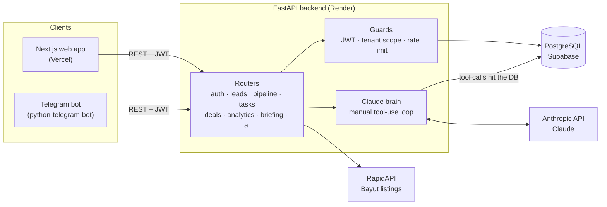

**Multi-tenancy:** every tenant-owned row carries `agency_id`, and every route is
scoped to the authenticated user's agency. Shared-pool listings use
`agency_id = NULL` so all tenants can see baseline inventory.

> ⚠️ Isolation is currently **application-level only**. There is no Postgres
> Row-Level Security, so one missed filter in a future route would leak data across
> agencies. See [Known gaps](#known-gaps).

### How an AI search actually runs

The model never invents listings — it calls a real database function whose results
are already restricted to the caller's agency.

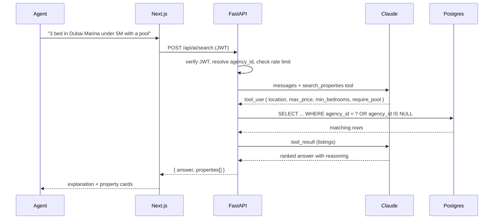

### Lead lifecycle

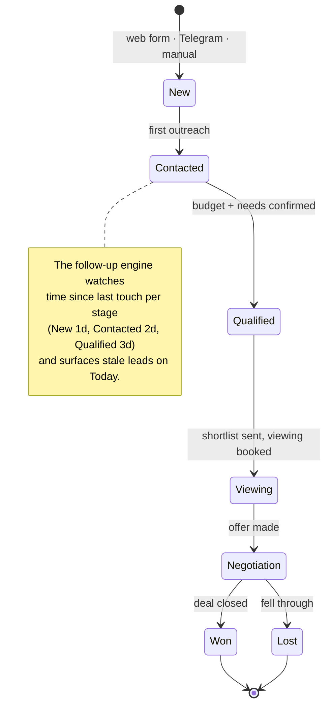

### Data model

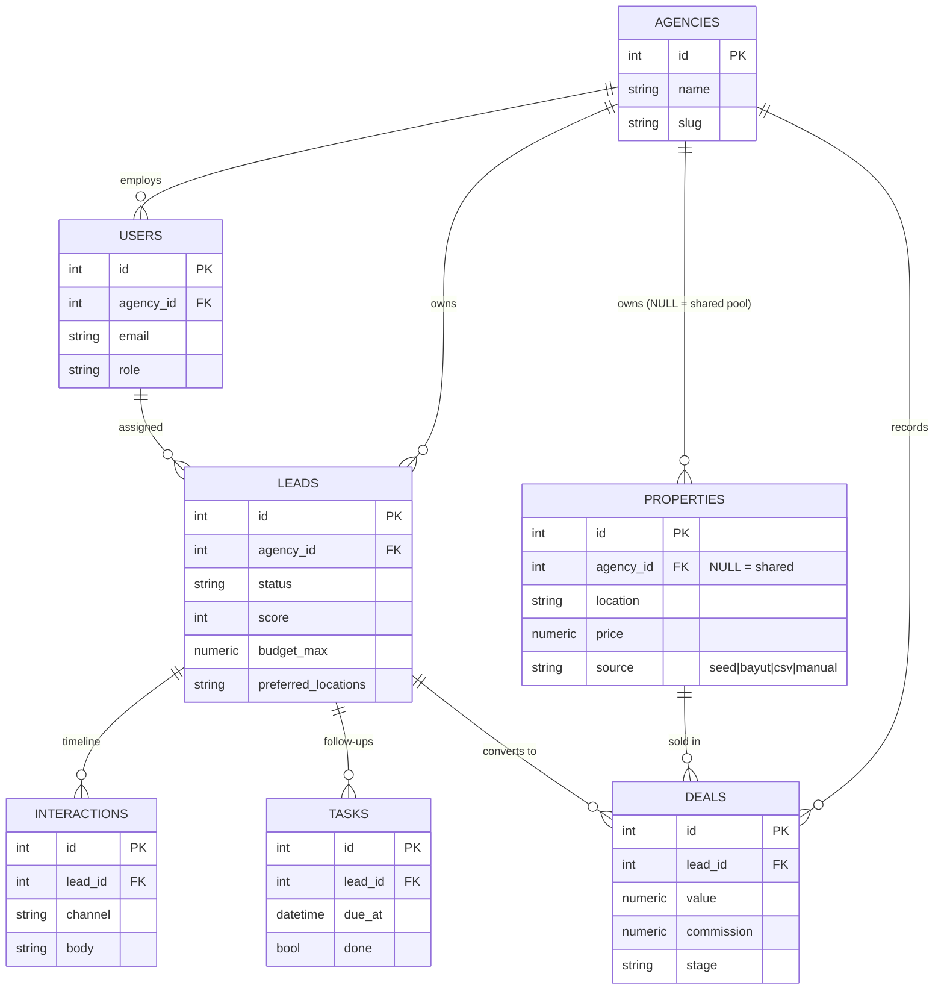

---

## Repository layout

```
dubai-real-estate/
├─ backend/                  FastAPI + Claude + DB
│  ├─ app/
│  │  ├─ main.py             app factory, routers, startup guards
│  │  ├─ config.py           settings + production safety checks
│  │  ├─ db.py               async engine, pooling (Supabase-pooler safe)
│  │  ├─ models.py           Agency, User, Property, Lead, Interaction, Task, Deal
│  │  ├─ security.py         bcrypt + JWT
│  │  ├─ ratelimit.py        per-agency AI spend guard
│  │  ├─ seed.py             demo agency + ~2,000 tiered-price listings
│  │  ├─ ai/
│  │  │  ├─ client.py        Anthropic client + manual tool-use loop
│  │  │  └─ broker_agent.py  search · match · pitch · marketing
│  │  ├─ integrations/bayut.py
│  │  └─ api/                auth, properties, leads, pipeline, tasks,
│  │                         deals, analytics, briefing, ai, health
│  ├─ Dockerfile · Procfile · requirements.txt
├─ frontend/                 Next.js 14 App Router
│  ├─ app/
│  │  ├─ page.tsx            landing
│  │  ├─ login/
│  │  └─ (app)/              protected: today, dashboard, pipeline,
│  │                         leads/[id], search, listings, market
│  ├─ components/            Sidebar, PropertyCard, ui/*, dashboard/*, market/*
│  └─ lib/
│     ├─ api.ts              typed fetch wrapper, auto-logout on 401
│     └─ viz.ts              validated chart colour tokens
├─ telegram_bot/             Telegram front-end
├─ docs/                     setup guides + screenshots
├─ render.yaml               Render blueprint for the API
├─ DEPLOY.md                 full deployment walkthrough
└─ PLAN.md · PROJECT_OVERVIEW.md
```

---

## API reference

```
Auth       POST /api/auth/signup · /login   GET /api/auth/me · /users
           POST /api/auth/invite
Properties GET|POST /api/properties        GET /api/properties/{id}
           POST /api/properties/import/bayut
           POST /api/properties/import/csv  GET …/import/csv/template
Leads      GET|POST /api/leads             GET|PATCH|DELETE /api/leads/{id}
           GET|POST /api/leads/{id}/interactions
Pipeline   GET  /api/pipeline
Tasks      GET|POST /api/tasks             PATCH|DELETE /api/tasks/{id}
           POST /api/tasks/{id}/done
Deals      GET|POST /api/deals             GET /api/deals/summary
           PATCH|DELETE /api/deals/{id}
Analytics  GET  /api/analytics/dashboard   GET /api/analytics/market
Briefing   GET  /api/briefing/today        (rule-based, zero AI cost)
AI         POST /api/ai/search · /match · /pitch · /marketing · /followup
Health     GET  /health (liveness)         GET /health/ready (DB check)
```

Interactive docs at `/docs` when `ENABLE_DOCS=true`.

---

## Running locally

**Prerequisites:** Python 3.12+, Node 18+, an [Anthropic API key](https://console.anthropic.com/settings/keys).

### Backend

```powershell
cd backend
python -m venv .venv
.\.venv\Scripts\Activate.ps1          # macOS/Linux: source .venv/bin/activate
pip install -r requirements.txt
Copy-Item .env.example .env           # then edit .env
uvicorn app.main:app --reload --port 8000
```

The only two values you must set in `.env` are `DATABASE_URL` (SQLite works out of
the box) and `ANTHROPIC_API_KEY`. First boot creates the tables, seeds the demo
agency and ~2,000 listings, and serves docs at http://localhost:8000/docs.

### Frontend

```powershell
cd frontend
npm install
Copy-Item .env.local.example .env.local   # NEXT_PUBLIC_API_URL=http://localhost:8000
npm run dev                               # http://localhost:3000
```

Sign in with `demo@demo.ae` / `demo12345`.

### Telegram bot (optional)

```powershell
cd telegram_bot
pip install -r requirements.txt
# .env: TELEGRAM_BOT_TOKEN from @BotFather
python bot.py
```

---

## Deployment

Three services. **Vercel hosts the frontend only** — FastAPI is a long-lived process
with a database connection pool, so it needs a container host.

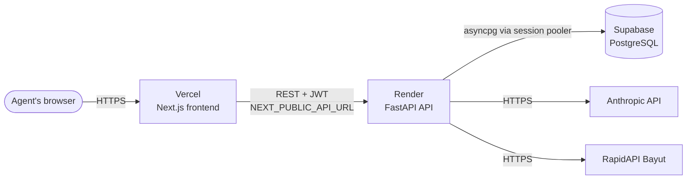

Deploy in this order — each step needs a value from the one before. Full
walkthrough with troubleshooting in **[DEPLOY.md](DEPLOY.md)**.

### 1. Database — Supabase

Create a project, then copy the **Session pooler** connection string
(Settings → Database → Connection string).

> ⚠️ Two things change together when you switch to the pooler, and missing either
> one is the most common setup failure:
>
> | | Host | Username |
> |---|---|---|
> | ❌ Direct | `db.<ref>.supabase.co` — **IPv6-only**, unreachable from Render | `postgres` |
> | ✅ Session pooler | `aws-<n>-<region>.pooler.supabase.com:5432` | `postgres.<project-ref>` |
>
> The `aws-<n>` prefix is `aws-0` or `aws-1` depending on when the project was
> created. Copy the string from the dashboard rather than assembling it by hand.

### 2. API — Render

[`render.yaml`](render.yaml) is a blueprint: **New → Blueprint → select this repo**.
It provisions the service with production env vars already set and prompts for the
three secrets that can't live in git.

| Variable | Value |
|---|---|
| `ENVIRONMENT` | `production` — turns on the startup safety checks |
| `DATABASE_URL` | Supabase **pooler** string from step 1 |
| `ANTHROPIC_API_KEY` | your key |
| `SECRET_KEY` | generated automatically by Render |
| `CORS_ORIGINS` | your Vercel URL (set after step 3) |
| `SEED_DEMO_DATA` | `false` — keeps 2,000 fake listings out of a real database |
| `RAPIDAPI_KEY` | optional, only for Bayut imports |

With `ENVIRONMENT=production` the app **refuses to start** if the secret key is the
shipped default, the database is SQLite, CORS is empty or `*`, or debug is on — a
failed boot is cheaper than forged tokens or a database that vanishes on redeploy.

Health check path: `/health`.

### 3. Frontend — Vercel

- **Root Directory: `frontend`** ← easy to miss, and nothing works without it
- Environment variable: `NEXT_PUBLIC_API_URL` = your Render URL, no trailing slash

`NEXT_PUBLIC_*` values are **inlined at build time**, so changing this later requires
a redeploy, not just a save.

### 4. Connect them

Copy the Vercel URL into `CORS_ORIGINS` on Render and redeploy the API. Then verify:

```bash
curl https://your-api.onrender.com/health/ready
# {"status":"ready","database":"connected","properties":2000}
```

Sign up an agency from the deployed frontend — a successful signup proves CORS,
the database, and the API URL are all wired correctly.

---

## Cost control

The AI bill is designed down, not discovered later:

| Guard | Default | Setting |
|---|---|---|
| Model | Haiku (cheapest capable) | `CLAUDE_MODEL` |
| Extended thinking | off | `USE_THINKING` |
| Output cap | 1,500 tokens | `AI_MAX_TOKENS` |
| Rate limit | 15 requests/min **per agency** | `AI_RATE_LIMIT_PER_MINUTE` |

The Today briefing — the most-used page — is **100% rule-based and spends no
tokens**. AI runs only when an agent explicitly asks for a draft, match, pitch, or
marketing pack.

---

## Design notes

**Chart colour is computed, not chosen.** Every value in
[`frontend/lib/viz.ts`](frontend/lib/viz.ts) was validated against the app's actual
chart surface for colour-vision-deficiency separation, lightness band, and contrast.
Three scales, three jobs, never mixed:

- **Series** (identity) — one colour when a chart shows one measure
- **Ordinal** (order) — a single-hue ramp that deepens along the pipeline or price bands
- **Status** (state) — reserved green/red for Won/Lost

Green vs red measures ΔE 4.1 under deuteranopia — effectively identical for
red-green colourblind readers — so Won/Lost **always carry an icon and a text
label**. Colour only reinforces.

---

## Known gaps

Honest limitations, not oversights:

- **Nothing sends.** Pitches and marketing copy are copy-to-clipboard. WhatsApp and
  email delivery are the next milestone.
- **No Row-Level Security.** Tenant isolation is enforced in application queries
  only. Postgres RLS is the next hardening step.
- **No automated tests.** Nothing catches a regression on deploy.
- **`alembic/versions/` is empty.** The app relies on `AUTO_CREATE_TABLES`, which
  creates tables but never alters them — the first schema change after launch needs
  a real migration.
- **Rate limiting is in-memory and per worker.** Accurate limits need Redis.
- **Deals and tasks have no UI.** The APIs exist; only the backend is wired.
- **The demo account is public.** `demo@demo.ae` / `demo12345` must be removed
  before any real agency uses this.

---

## Roadmap

**Next** — outreach delivery (Telegram push, then WhatsApp Business API), email
integration, RLS, a public lead-capture form that feeds the pipeline.

**Later** — DLD/Dubai Pulse transaction data, AI lead scoring, viewing scheduler with
calendar sync, document generation, Stripe billing and per-agency branding, Arabic
RTL support.

---

*Built with FastAPI, Next.js, and Claude — for the Dubai real-estate market.*
